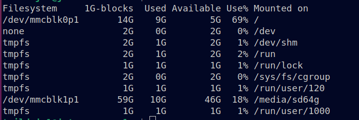
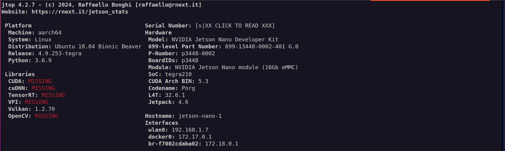

# Pool Angel

## Setup Jetson Nano

requirements:

- The lastest version Jetpack 4.6 for Jetson Nano device. 
Do not install CUDA, cuDNN, TensorRT, VPI, OpenCV option from SDK-Manager to save storage disk

Preprare Jetson Nano device 16G EMC and mount addition 64G SD-Card as bellow



- Install jtop [https://pypi.org/project/jetson-stats/] and check system information

```bash
sudo apt-get update
sudo apt-get install -y python3-pip
sudo pip3 install -U jetson-stats
sudo jtop
```



- Install docker and docker-compose

```bash
sudo ./new_code/scripts/install_docker_engine.sh
sudo ./new_code/scripts/install_nvidia_docker_runtime.sh
wget https://github.com/docker/compose/releases/download/v2.26.0/docker-compose-linux-aarch64
sudo mv docker-compose-linux-aarch64 /usr/local/bin/docker-compose
sudo chmod +x /usr/local/bin/docker-compose
sudo reboot
```
- Dowload docker-image and model from [here](https://drive.google.com/drive/folders/1EhTQk4puu_d49ZRkUFAqy0iO6iUMmax_?usp=sharing).</br>
`yolov8s-640.onnx`: place model to /media/sd64g/workspace/Pool-Angel-box/new_code/models/yolov8s-640.onnx</br>
`child-adult-cls-yolov8s-128.onnx`: place model to /media/sd64g/workspace/Pool-Angel-box/new_code/models/child-adult-cls-yolov8s-128.onnx</br>
`mobile_sam_Oct23_gelu_approx_no_cf.onnx`: place model to /media/sd64g/workspace/Pool-Angel-box/data/mobile_sam_Oct23_gelu_approx_no_cf.onnx</br>
`mobile_sam_opset11.onnx`: place model to /media/sd64g/workspace/Pool-Angel-box/data/mobile_sam_opset11.onnx</br>
`l4t_trt_image.rar`: import docker image by the following command:
```bash
docker import - l4t_trt_image < l4t_trt_image.rar
```
## creat docker container
```bash
docker-compose -f new_code/docker-compose-test.yaml -p aicore up -d
```
## start docker container
```bash
docker exec -it aicore bash
```
## build trt model

```bash

/usr/src/tensorrt/bin/trtexec --onnx=new_code/models/yolov8s-640.onnx --saveEngine=new_code/models/yolov8s-640.onnx.engine --buildOnly --fp16

/usr/src/tensorrt/bin/trtexec --onnx=new_code/models/child-adult-cls-yolov8s-128.onnx --saveEngine=new_code/models/child-adult-cls-yolov8s-128.onnx --buildOnly --fp16
```
## run code
```bash
python3 main.py --input <path video file>
```
## check output

```bash
ls ./data/output/output.mkv
```


```
Pool Boundary Specification:
Create 2 zones around the pool edge.
Zone 1 - Z1 - On the pool
Zone 2 - Z2 - 2 to 3 meters from the edge of pool

List for alerts
1. Unattended child (no adult present) enters in Z2
2. ⁠Child enters in Z1 and no reaction from adult i.e. child disappears under water for x time and parent does not intervene
3. ⁠Unattended child (no adult present) enters in Z1
4. Adult or child slip in Z2
5. Adult or child slip and enter in Z1
6. Medical episodes like seizure, fits, heart attack in Z1 or Z2
```